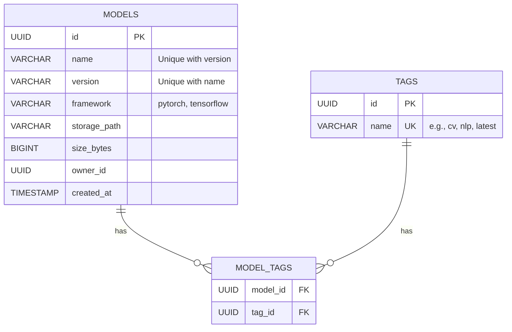

# 节点1.6：Model Registry 数据库设计

> 本章节内容由原 **阶段2节点2.1** 移入阶段1，作为数据库设计与迁移的补充。

## 学习目标
- 掌握 SQLAlchemy 2.0 的声明式模型定义 (Declarative Mapping)
- 理解并实现多对多关系 (Many-to-Many Relationship)
- 掌握 Alembic 数据库迁移工具的配置与使用
- 理解 Repository 模式在数据访问层的作用

## 1. 数据库设计 (ER 图)

我们需要存储模型 (Model) 的元数据，以及模型与其标签 (Tag) 的关系。



### 关键约束
- **唯一性**：`(name, version)` 组合必须唯一。同一个模型名下不能有两个 `v1.0`。
- **标签**：标签名全局唯一。一个模型可以有多个标签，一个标签可以挂在多个模型上 (M:N)。

## 2. Alembic 迁移指南

Alembic 是 SQLAlchemy 的官方迁移工具。它能根据你的 Python 模型代码自动生成 SQL 更新脚本。

### 初始化
```bash
uv run alembic init alembic
```

### 关键配置 (`alembic/env.py`)
默认生成的 `env.py` 是同步的，且没有加载我们的配置。我们需要修改它以支持：
1.  **加载项目配置**：从 `settings.py` 读取数据库 URL、用户名密码。
2.  **异步执行**：因为我们使用的是 `asyncpg` 驱动。
3.  **识别模型**：导入 `Base`，让 Alembic 能检测到模型的变化。

### 常用命令
```bash
# 生成迁移脚本 (Auto generate)
# -m: 注释
uv run alembic revision --autogenerate -m "create models tables"

# 执行迁移 (Upgrade to head)
uv run alembic upgrade head

# 回滚 (Downgrade)
uv run alembic downgrade -1
```

## 3. 实操步骤

1.  **定义模型**：在 `model_registry/internal/domain/model.py` 中编写 `Model` 和 `Tag` 类。
2.  **初始化 Alembic**：运行 `alembic init`。
3.  **配置 Alembic**：修改 `alembic.ini` 和 `alembic/env.py`。
4.  **生成脚本**：`revision --autogenerate`。
5.  **应用变更**：`upgrade head`。
6.  **验证**：查看数据库表结构。

## 检查点
- [ ] `alembic/env.py` 已配置为异步模式
- [ ] 成功生成迁移脚本 `versions/xxxx_create_models_tables.py`
- [ ] 数据库中存在 `models`, `tags`, `model_tags` 表
- [ ] `uid_model_name_version` 联合唯一索引已创建
