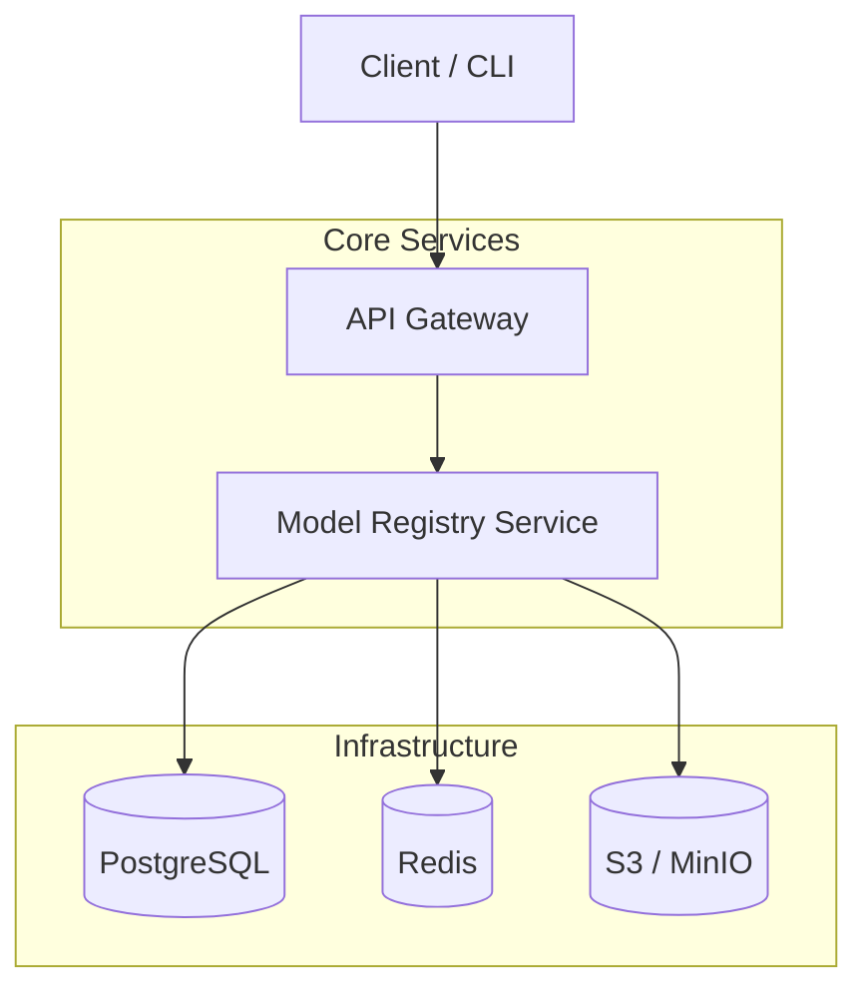

# 阶段2：核心功能开发 (Core Function Development)

> 🚀 **阶段目标**：实现 MaaS 平台核心业务流程，包括服务间通信、缓存、认证、模型管理与推理服务。

## 阶段总览

### 学习时间
**5周**（约25个工作日）

### 核心目标
1. 掌握 gRPC 服务间通信
2. 学会 Redis 缓存策略与设计
3. 实现 JWT 认证与 RBAC 权限控制
4. 处理模型文件上传与分片
5. 构建模型推理服务
6. 理解版本控制与依赖管理

### 最终产出
- ✅ API Gateway 通过 gRPC 调用 Model Registry
- ✅ Redis 多级缓存支持
- ✅ 完整的用户认证体系（JWT + RBAC）
- ✅ 模型文件上传与版本管理
- ✅ 可调用模型的推理接口

---

## 节点路线图

### [节点2.1：gRPC 服务间通信](./node-2-1.md)
- **目标**：API Gateway 与 Model Registry 的 gRPC 通信
- **关键技术**：grpcio, Protobuf
- **产出**：统一的 `model.proto`、gRPC Server/Client

### [节点2.2：Redis 缓存层设计](./node-2-2.md)
- **目标**：缓存热点模型查询，提高响应速度
- **关键技术**：redis / cache-aside
- **产出**：模型查询缓存、缓存失效策略

### 节点2.3：认证与授权
- **目标**：JWT 登录体系 + RBAC 权限控制
- **关键技术**：PyJWT, Casbin
- **产出**：用户认证、Token 刷新、权限校验中间件

### 节点2.4：模型上传与存储
- **目标**：支持大模型文件上传、断点续传
- **关键技术**：MinIO / S3 / 分片上传
- **产出**：上传接口、预签名 URL

### 节点2.5：模型版本管理
- **目标**：实现语义化版本控制与标签系统
- **关键技术**：SemVer
- **产出**：版本查询、latest 标签、回滚

### 节点2.6：推理服务基础
- **目标**：实现可调用推理接口与并发控制
- **关键技术**：gRPC/HTTP、工作池、限流
- **产出**：推理服务框架、超时与并发管理

---

## 阶段2架构概览

---

## 阶段2里程碑（检查清单）

- [ ] API Gateway 通过 gRPC 调用 Model Registry
- [ ] Redis 缓存命中率 > 50%
- [ ] JWT 认证与 RBAC 权限控制生效
- [ ] 模型文件可上传并存储
- [ ] 模型版本管理完整
- [ ] 推理接口可调用

---

**继续学习**：从节点2.1开始 → [node-2-1.md](./node-2-1.md)
